<p align="center">
  
</p>

<p align="center">
  <strong>The Definitive Cloud OSINT Resource - Uncover the Unseen</strong>
</p>

<p align="center">
  <a href="https://awesome.re"></a>
  
  
  
  
  
  
</p>

<p align="center">
  <sub>Curated collection of OSINT resources for cloud infrastructure reconnaissance.<br>
  Includes dorks, tools, techniques, and methodologies for AWS, Azure, GCP, Oracle Cloud, IBM Cloud, and more.<br>
  Built for security professionals, red teamers, bug bounty hunters, and cloud architects.</sub>
</p>

<p align="center">
  If you find this useful, please ⭐ <strong>star this repo</strong> — it helps others discover it!
</p>

---

## 📖 Contents

- [🗺️ Cloud OSINT Methodology](#️-cloud-osint-methodology)
- [☁️ Cloud Infrastructure Patterns](#️-cloud-infrastructure-patterns)
  - [🔵 Azure Storage](#-azure-storage)
  - [🟠 AWS Regions](#-aws-regions)
  - [🟠 AWS S3 Buckets](#-aws-s3-buckets)
  - [🟠 AWS SQS](#-aws-sqs)
  - [🔴 GCP Technologies](#-gcp-technologies)
  - [⚫ IBM Cloud](#-ibm-cloud)
  - [🟤 Oracle Cloud](#-oracle-cloud)
  - [📡 Official IP Range Sources](#-official-ip-range-sources)
- [🔍 Google Dorks](#-google-dorks)
  - [Azure Dorks](#azure-dorks)
  - [AWS Dorks](#aws-dorks)
  - [Google Cloud Dorks](#google-cloud-dorks)
  - [IBM Cloud Dorks](#ibm-cloud-dorks)
  - [Miscellaneous Dorks](#miscellaneous-dorks)
- [🌐 Shodan Dorks](#-shodan-dorks)
  - [Filter Reference](#filter-reference)
  - [Azure Queries](#azure-queries)
  - [Amazon Queries](#amazon-queries)
  - [Other Cloud Queries](#other-cloud-queries)
- [🔐 Certificate Transparency](#-certificate-transparency)
- [📚 Web Cloud OSINT Resources](#-web-cloud-osint-resources)
- [🛠️ Cloud OSINT Tools](#️-cloud-osint-tools)
  - [Multi-Cloud Tools](#multi-cloud-tools)
  - [AWS-Specific Tools](#aws-specific-tools)
  - [Azure-Specific Tools](#azure-specific-tools)
  - [GCP-Specific Tools](#gcp-specific-tools)
  - [Bucket and Storage Discovery](#bucket--storage-discovery)
- [🌍 Domain and Subdomain Identification](#-domain--subdomain-identification)
- [📝 Dork Generation Tools](#-dork-generation-tools)
- [📦 Additional Resources](#-additional-resources)
- [⚖️ Responsible Use](#️-responsible-use)
- [🤝 Contributing](#-contributing)

---

## 🗺️ Cloud OSINT Methodology

> Cloud OSINT follows a structured reconnaissance workflow. Use this framework to map resources to your investigation phase.

```mermaid
    graph LR
      A["🔍 Passive Recon"] --> B["📡 Infrastructure Mapping"]
      B --> C["🗂️ Asset Discovery"]
      C --> D["🔓 Exposure Analysis"]
      D --> E["📊 Reporting"]

        style A fill:#1a1a2e,stroke:#e94560,color:#fff
        style B fill:#1a1a2e,stroke:#0f3460,color:#fff
        style C fill:#1a1a2e,stroke:#533483,color:#fff
        style D fill:#1a1a2e,stroke:#e94560,color:#fff
        style E fill:#1a1a2e,stroke:#0f3460,color:#fff
```


| Phase | Techniques | Tools and Resources |
|-------|-----------|-------------------|
| **🔍 Passive Recon** | Google dorks, Shodan queries, DNS lookups, Certificate Transparency | DorkSearch, Shodan, crt.sh, Censys |
| **📡 Infrastructure Mapping** | IP range analysis, cloud provider identification, region mapping | AWS ip-ranges.json, Azure IP ranges, BGP lookups |
| **🗂️ Asset Discovery** | Bucket enumeration, subdomain discovery, storage scanning | CloudEnum, cloud_enum, S3Scanner, GrayhatWarfare |
| **🔓 Exposure Analysis** | Misconfiguration detection, sensitive data search, access testing | S3Browser, BucketLoot, ScoutSuite, Prowler |
| **📊 Reporting** | Findings consolidation, evidence collection, risk assessment | Manual analysis + tool outputs |

[↑ Back to Contents](#-contents)

---

## ☁️ Cloud Infrastructure Patterns

> Understanding cloud URL patterns, regions, and service endpoints is the foundation of Cloud OSINT.

### 🔵 Azure Storage

| Service | URL Pattern |
|---------|-------------|
| Blob Storage | `http://<storageaccount>.blob.core.windows.net` |
| Table Storage | `http://<storageaccount>.table.core.windows.net` |
| Queue Storage | `http://<storageaccount>.queue.core.windows.net` |
| Azure Files | `http://<storageaccount>.file.core.windows.net` |
| Database | `http://<storageaccount>.database.windows.net` |

### 🟠 AWS Regions

<details>
<summary>Click to expand full AWS regions list (36 regions)</summary>

| Region Code | Location |
|-------------|----------|
| `af-south-1` | Africa (Cape Town) |
| `ap-east-1` | Asia Pacific (Hong Kong) |
| `ap-northeast-1` | Asia Pacific (Tokyo) |
| `ap-northeast-2` | Asia Pacific (Seoul) |
| `ap-northeast-3` | Asia Pacific (Osaka) |
| `ap-south-1` | Asia Pacific (Mumbai) |
| `ap-south-2` | Asia Pacific (Hyderabad) |
| `ap-southeast-1` | Asia Pacific (Singapore) |
| `ap-southeast-2` | Asia Pacific (Sydney) |
| `ap-southeast-3` | Asia Pacific (Jakarta) |
| `ap-southeast-4` | Asia Pacific (Melbourne) |
| `ap-southeast-5` | Asia Pacific (Malaysia) |
| `ap-southeast-7` | Asia Pacific (Thailand) |
| `ca-central-1` | Canada (Central) |
| `ca-west-1` | Canada (Calgary) |
| `cn-north-1` | China (Beijing) |
| `cn-northwest-1` | China (Ningxia) |
| `eu-central-1` | Europe (Frankfurt) |
| `eu-central-2` | Europe (Zurich) |
| `eu-north-1` | Europe (Stockholm) |
| `eu-south-1` | Europe (Milan) |
| `eu-south-2` | Europe (Spain) |
| `eu-west-1` | Europe (Ireland) |
| `eu-west-2` | Europe (London) |
| `eu-west-3` | Europe (Paris) |
| `il-central-1` | Israel (Tel Aviv) |
| `me-central-1` | Middle East (UAE) |
| `me-south-1` | Middle East (Bahrain) |
| `mx-central-1` | Mexico (Central) |
| `sa-east-1` | South America (Sao Paulo) |
| `us-east-1` | US East (N. Virginia) |
| `us-east-2` | US East (Ohio) |
| `us-gov-east-1` | AWS GovCloud (US-East) |
| `us-gov-west-1` | AWS GovCloud (US-West) |
| `us-west-1` | US West (N. California) |
| `us-west-2` | US West (Oregon) |

</details>

### 🟠 AWS S3 Buckets

| Pattern | URL Format |
|---------|------------|
| Path style | `https://s3.amazonaws.com/[bucketname]` |
| Virtual hosted | `https://[bucketname].s3.amazonaws.com` |
| Region specific | `https://s3-[region].amazonaws.com/[bucketname]/` |
| Website hosting | `https://[bucketname].s3-website-[region].amazonaws.com/` |

### 🟠 AWS SQS
```
https://sqs.[region].amazonaws.com
```

### 🔴 GCP Technologies

- [GCP Technologies Cheatsheet](https://googlecloudcheatsheet.withgoogle.com) - Visual overview of all Google Cloud services and their relationships.
- [GCP Regions and Zones](https://cloud.google.com/compute/docs/regions-zones) - Complete list of GCP datacenter locations worldwide.

### ⚫ IBM Cloud

- [IBM Global Cloud Data Centers](https://www.ibm.com/cloud/data-centers) - Map and list of all IBM Cloud datacenter locations.
- [IBM Cloud IP Ranges](https://cloud.ibm.com/docs/cloud-infrastructure?topic=cloud-infrastructure-ibm-cloud-ip-ranges) - Official IP address ranges for IBM Cloud infrastructure.

### 🟤 Oracle Cloud

- [Oracle Cloud Regions](https://www.oracle.com/cloud/data-regions/) - All Oracle Cloud Infrastructure (OCI) region locations.
- [Oracle Cloud IP Ranges](https://docs.oracle.com/en-us/iaas/Content/General/Concepts/addressranges.htm) - Official OCI IP address ranges documentation.

### 📡 Official IP Range Sources

> Direct links to query cloud provider IP ranges programmatically.

| Provider | Source | Quick Query |
|----------|--------|-------------|
| AWS | [ip-ranges.json](https://ip-ranges.amazonaws.com/ip-ranges.json) | `curl -s https://ip-ranges.amazonaws.com/ip-ranges.json \| jq '.prefixes[]'` |
| Azure | [ServiceTags](https://www.microsoft.com/en-us/download/details.aspx?id=56519) | Download weekly JSON from Microsoft Download Center |
| GCP | [cloud.json](https://www.gstatic.com/ipranges/cloud.json) | `curl -s https://www.gstatic.com/ipranges/cloud.json \| jq '.prefixes[]'` |
| Oracle | [public_ip_ranges.json](https://docs.oracle.com/en-us/iaas/tools/public_ip_ranges.json) | `curl -s https://docs.oracle.com/en-us/iaas/tools/public_ip_ranges.json` |

[↑ Back to Contents](#-contents)

---

## 🔍 Google Dorks

> Search engine queries crafted to discover exposed cloud assets, misconfigurations, and sensitive data across major cloud providers.

### Azure Dorks
```
site:blob.core.windows.net "keyword"
site:"blob.core.windows.net" intext:"CONFIDENTIAL"
site:*.core.windows.net intext:"TLP:RED"
site:*.core.windows.net
site:*.core.windows.net +blob
site:*.core.windows.net +files -web -blob
site:*.core.windows.net -web
site:*.core.windows.net -web -blob -files
site:*.core.windows.net inurl:dsts.dsts
site:*.core.windows.net inurl:"term" -web
site:*.blob.core.windows.net ext:xls | ext:xlsx (login | password | username)
intext:connectionstring blob filetype:config
intext:accountkey windows.net filetype:xml
intext:storageaccountkey windows.net filetype:txt
```

> **💡 Azure SAS Tokens:** Search for `"bfqt&srt"` to find exposed Shared Access Signature tokens.

### AWS Dorks
```
site:"s3-external-1.amazonaws.com" intext:CONFIDENTIAL
site:"s3.amazonaws.com" intext:CONFIDENTIAL
site:"s3.dualstack.us-east-1.amazonaws.com" intext:CONFIDENTIAL
site:"s3-external-1.amazonaws.com" intext:"TOP SECRET"
site:"s3.amazonaws.com" intext:"tlp:red"
site:"s3.amazonaws.com" intext:"tlp:amber"
site:s3.amazonaws.com example
site:s3.amazonaws.com example.com
site:s3.amazonaws.com example-com
site:s3.amazonaws.com com.example
site:s3.amazonaws.com com-example
site:s3.amazonaws.com filetype:xls password
site:http://s3.amazonaws.com intitle:index.of.bucket
site:http://amazonaws.com inurl:".s3.amazonaws.com/"
s3 site:amazonaws.com filetype:log
site:http://trello.com "aws.amazon.com" "password"
```

### Google Cloud Dorks
```
site:googleapis.com +commondatastorage
site:.firebaseio.com "COMPANY NAME"
inurl:bc.googleusercontent.com intitle:index of
site:storage.googleapis.com
site:console.cloud.google.com/storage/browser
site:console.cloud.google.com/storage/browser/_details
site:firebasestorage.googleapis.com
```

### IBM Cloud Dorks
```
site:appdomain.cloud
site:appdomain.cloud +s3
site:*cloud-object-storage.appdomain.cloud
site:codeengine.appdomain.cloud
site:containers.appdomain.cloud
site:clb.appdomain.cloud
site:apiconnect.appdomain.cloud
site:cdn.appdomain.cloud
site:lb.appdomain.cloud
site:vmware.cloud.ibm.com
site:appid.cloud.ibm.com
site:ibmmarketingcloud.com
```

### Miscellaneous Dorks
```
site:notion.site "keyword"
site:digitaloceanspaces.com "keyword"
site:*.cloudfront.net "keyword"
site:*.herokuapp.com "keyword"
site:*.netlify.app "keyword"
site:*.vercel.app "keyword"
```

[↑ Back to Contents](#-contents)

---

## 🌐 Shodan Dorks

> Shodan queries to discover cloud-hosted services, misconfigurations, and exposed infrastructure.

### Filter Reference

| Filter | Description |
|--------|-------------|
| `cloud.provider` | Filter by cloud provider name (Amazon, Azure, Google, etc.) |
| `cloud.region` | Filter by cloud region identifier |
| `cloud.service` | Filter by specific cloud service name |

### Azure Queries
```
cloud.service:"azureCloud"
cloud.service:"azureCloud" country:GB,US http.title:"swagger" http.status:200
cloud.service:"azureCloud" http.status:200 country:GB,US -http.title:"Your Azure Function App is up and running." -http.title:"IIS Windows Server"
cloud.provider:"Azure" country:GB,US http.status:200 http.title:"Index of /" ssl:true
cloud.provider:"Azure" country:GB,US http.status:200 http.title:"Index of /"
cloud.provider:"Azure" hostname:"cloudapp.net" http.status:200,302
cloud.service:"AzureCloud" http.status:200 http.title:"api"
```

### Amazon Queries
```
cloud.provider:"Amazon"
cloud.provider:"Amazon" http.status:200,302 http.title:"Index of /"
cloud.provider:"Amazon" http.status:200 "aws" "key"
cloud.provider:"Amazon" http.title:"Dashboard" http.status:200
```

### Other Cloud Queries
```
cloud.provider:"Google" http.status:200
cloud.provider:"Oracle" http.status:200
site:vps-*.vps.ovh.net
cloud.provider:"DigitalOcean" http.status:200,302
```

[↑ Back to Contents](#-contents)

---

## 🔐 Certificate Transparency

> Certificate Transparency (CT) logs record every SSL/TLS certificate issued, making them a goldmine for discovering cloud-hosted assets and subdomains.

- [crt.sh](https://crt.sh) - Search CT logs by domain, organization, or certificate fingerprint. Use `%.example.com` to find all subdomains.
- [Censys Certificates](https://search.censys.io/certificates) - Advanced certificate search with filters for cloud provider organizations.
- [CertStream](https://certstream.calidog.io/) - Real-time certificate issuance monitoring to detect new cloud deployments as they go live.
- [Facebook CT Monitor](https://developers.facebook.com/tools/ct/) - Monitor certificates issued for specific domains.

**Example CT queries for cloud assets:**
```bash
# Find all subdomains via crt.sh
curl -s "https://crt.sh/?q=%.example.com&output=json" | jq -r '.[].name_value' | sort -u

# Search for cloud-specific certificate organizations
# On crt.sh: O=Amazon, O=Microsoft Corporation, O=Google Trust Services
```

[↑ Back to Contents](#-contents)

---

## 📚 Web Cloud OSINT Resources

> Online platforms and search engines for discovering exposed cloud assets and misconfigurations.

- [GrayhatWarfare](https://buckets.grayhatwarfare.com/) - Search engine for open S3 buckets, Azure blobs, and GCP storage across cloud providers.
- [Google Custom Search for Cloud Storage](https://cse.google.com/cse?cx=002972716746423218710:veac6ui3rio#gsc.tab=0) - Custom Google search engine focused on cloud storage buckets and containers.
- [FullHunt](https://fullhunt.io/) - Attack surface discovery platform with cloud asset identification capabilities.
- [AADInternals OSINT](https://aadinternals.com/osint/) - Azure Active Directory tenant information including subdomains and configuration data.
- [SOCRadar BlueBleed](https://socradar.io/labs/bluebleed) - Discover misconfigured servers containing sensitive data across Azure, AWS, and GCP storage.
- [Forager by TruffleSecurity](https://forager.trufflesecurity.com/explore) - Explore exposed cloud and service keys/credentials found in public sources.
- [AWS Eye](https://awseye.com/) - OSINT tool for investigating AWS configurations, identifying misconfigured S3 buckets, and uncovering cloud exposures.
- [LeakIX](https://leakix.net/) - Search engine for exposed services and data leaks, with cloud infrastructure filters.
- [PublicWWW](https://publicwww.com/) - Source code search engine useful for finding websites connected to specific cloud services.

> **💡 Tip:** Use the GrayhatWarfare API to programmatically search for exposed files:
> ```
> curl "https://buckets.grayhatwarfare.com/api/v1/files/[KEYWORD]?access_token=[TOKEN]&extensions=docx,xlsx,pdf"
> ```

[↑ Back to Contents](#-contents)

---

## 🛠️ Cloud OSINT Tools

> Curated collection of tools for cloud reconnaissance, enumeration, and security assessment. Organized by scope and cloud provider.

### Multi-Cloud Tools

- [CloudEnum](https://github.com/initstring/cloud_enum) - Multi-cloud OSINT tool that enumerates public resources across AWS, Azure, and GCP simultaneously.
- [CloudBrute](https://github.com/0xsha/CloudBrute) - Cloud infrastructure discovery tool supporting multiple providers with concurrent enumeration.
- [CloudFox](https://github.com/BishopFox/cloudfox) - Automating situational awareness for cloud penetration testing across AWS, Azure, and GCP.
- [CloudSploit](https://github.com/aquasecurity/cloudsploit) - Cloud security posture management detecting misconfigurations across AWS, Azure, GCP, and Oracle.
- [Cartography](https://github.com/lyft/cartography) - Consolidates infrastructure assets and relationships across cloud providers into a graph database.
- [Prowler](https://github.com/prowler-cloud/prowler) - Open-source cloud security tool for AWS, Azure, GCP, and Kubernetes with 300+ checks.
- [ScoutSuite](https://github.com/nccgroup/ScoutSuite) - Multi-cloud security auditing tool for AWS, Azure, GCP, Alibaba Cloud, and Oracle Cloud configurations.
- [Steampipe](https://github.com/turbot/steampipe) - Query cloud infrastructure using SQL across AWS, Azure, GCP, and 100+ other services.

### AWS-Specific Tools

- [AWSBucketDump](https://github.com/jordanpotti/AWSBucketDump) - Quickly enumerate AWS S3 buckets and search for interesting files within discovered buckets.
- [enumerate-iam](https://github.com/andresriancho/enumerate-iam) - Enumerate IAM permissions for a given set of AWS credentials without logging.
- [lazys3](https://github.com/nahamsec/lazys3) - Brute-force AWS S3 bucket discovery using different permutations of common names.
- [Pacu](https://github.com/RhinoSecurityLabs/pacu) - AWS exploitation framework designed for offensive security testing of cloud environments.
- [S3Scanner](https://github.com/sa7mon/S3Scanner) - Scan for open S3 buckets, dump their contents, and check bucket permissions.
- [WeirdAAL](https://github.com/carnal0wnage/weirdAAL) - AWS Attack Library for testing and validating AWS security configurations.

### Azure-Specific Tools

- [AADInternals](https://github.com/Gerenios/AADInternals) - PowerShell module for Azure AD and Office 365 administration, exploitation, and backdooring.
- [MicroBurst](https://github.com/NetSPI/MicroBurst) - PowerShell toolkit for attacking Azure services including storage, key vaults, and more.
- [ROADtools](https://github.com/dirkjanm/ROADtools) - Framework for Azure AD reconnaissance and exploration of directory data.
- [Stormspotter](https://github.com/Azure/Stormspotter) - Azure AD and resource visualization tool for mapping attack paths.

### GCP-Specific Tools

- [GCPBucketBrute](https://github.com/RhinoSecurityLabs/GCPBucketBrute) - Enumerate Google Storage buckets, determine access permissions, and check privilege escalation.
- [gcp_enum](https://gitlab.com/gitlab-com/gl-security/threatmanagement/redteam/redteam-public/gcp_enum) - GCP enumeration tool for discovering and auditing Google Cloud resources.
- [Hayat](https://github.com/DenizParlworksak/hayat) - GCP resource enumeration and analysis tool for security assessments.

### Bucket and Storage Discovery

- [bucket_finder](https://github.com/FishermansEnemy/bucket_finder) - Tool to bruteforce for the existence of AWS S3 buckets and check permissions.
- [BucketLoot](https://github.com/redhuntlabs/BucketLoot) - Automated tool to inspect exposed storage buckets for sensitive data across cloud providers.
- [S3 Browser](https://s3browser.com) - Windows client for Amazon S3 and CloudFront, useful for browsing discovered bucket contents.

[↑ Back to Contents](#-contents)

---

## 🌍 Domain and Subdomain Identification

> Tools and services for discovering domains, subdomains, and cloud-associated hostnames.

- [Censys Search](https://search.censys.io/) - Search engine for hosts, domains, SSL certificates, and cloud-associated infrastructure.
- [crt.sh](https://crt.sh) - Find domains and subdomains through SSL certificate transparency logs.
- [DNSDumpster](https://dnsdumpster.com/) - Domain research tool for DNS recon and discovering hosts related to a target domain.
- [osint.sh DNS History](https://osint.sh/dnshistory/) - Historical DNS record lookup to track infrastructure changes over time.
- [osint.sh Subdomain Finder](https://osint.sh/subdomain/) - Subdomain enumeration through multiple data sources.
- [SecurityTrails](https://securitytrails.com/) - Historical DNS data and domain intelligence with API access for automation.
- [Spyse](https://spyse.com/tools/subdomain-finder) - Domain and subdomain enumeration with detailed DNS intelligence.
- [Subfinder](https://github.com/projectdiscovery/subfinder) - Fast passive subdomain enumeration tool using multiple online sources.
- [ZoomEye](https://www.zoomeye.org/) - Cyberspace search engine for discovering internet-connected devices and exposed services.

[↑ Back to Contents](#-contents)

---

## 📝 Dork Generation Tools

> Tools to help craft and optimize search engine dorks for cloud OSINT investigations.

- [DorkSearch](https://dorksearch.com/) - Visual dork builder with pre-built templates for common cloud searches.
- [DorkGPT](https://www.dorkgpt.com/) - AI-powered Google dork generator using ChatGPT for custom query creation.
- [Google Hacking Database (GHDB)](https://www.exploit-db.com/google-hacking-database) - Extensive database of Google dork queries categorized by target type.

[↑ Back to Contents](#-contents)

---

## 📦 Additional Resources

> Complementary tools and platforms that enhance Cloud OSINT workflows.

- [Dedigger](https://www.dedigger.com/#) - Find exposed files in Google Drive using search terms like AWS, Azure, GCP, etc.
- [httpx](https://github.com/projectdiscovery/httpx) - Fast HTTP toolkit useful for probing discovered cloud endpoints at scale.
- [IntelX](https://intelx.io/) - Intelligence search engine indexing historical data from cloud services, paste sites, and data leaks.
- [Nuclei](https://github.com/projectdiscovery/nuclei) - Vulnerability scanner with cloud-specific templates for detecting misconfigurations.

[↑ Back to Contents](#-contents)

---

## ⚖️ Responsible Use

> **⚠️ Important:** The resources in this repository are intended for **authorized security testing, educational purposes, and legitimate research only**.

Cloud OSINT techniques can reveal sensitive information about organizations' cloud infrastructure. Users of this repository are expected to:

- **Obtain proper authorization** before conducting any reconnaissance against cloud infrastructure you do not own.
- **Follow applicable laws** including the Computer Fraud and Abuse Act (CFAA), GDPR, and equivalent regulations in your jurisdiction.
- **Practice responsible disclosure** if you discover exposed data or misconfigurations belonging to third parties.
- **Respect privacy** and avoid accessing, downloading, or distributing sensitive data found through these techniques.

Neither the maintainers of this repository nor 7Way Security are responsible for any misuse of the information provided herein.

[↑ Back to Contents](#-contents)

---

## 🤝 Contributing

Contributions are welcome and appreciated! Please read our [Contributing Guidelines](CONTRIBUTING.md) before submitting a PR.

**Quick contribution guide:**

1. Fork this repository
2. Add your resource following the format: `- [Tool Name](https://url.com) - Brief description of what it does.`
3. Ensure your addition is placed in the correct category
4. Submit a Pull Request

See [CONTRIBUTING.md](CONTRIBUTING.md) for detailed instructions.

---

<p align="center">
  <sub>Maintained with ❤️ by <a href="https://github.com/7WaySecurity">7Way Security</a> | <a href="https://7waysecurity.com">7waysecurity.com</a></sub>
</p>
